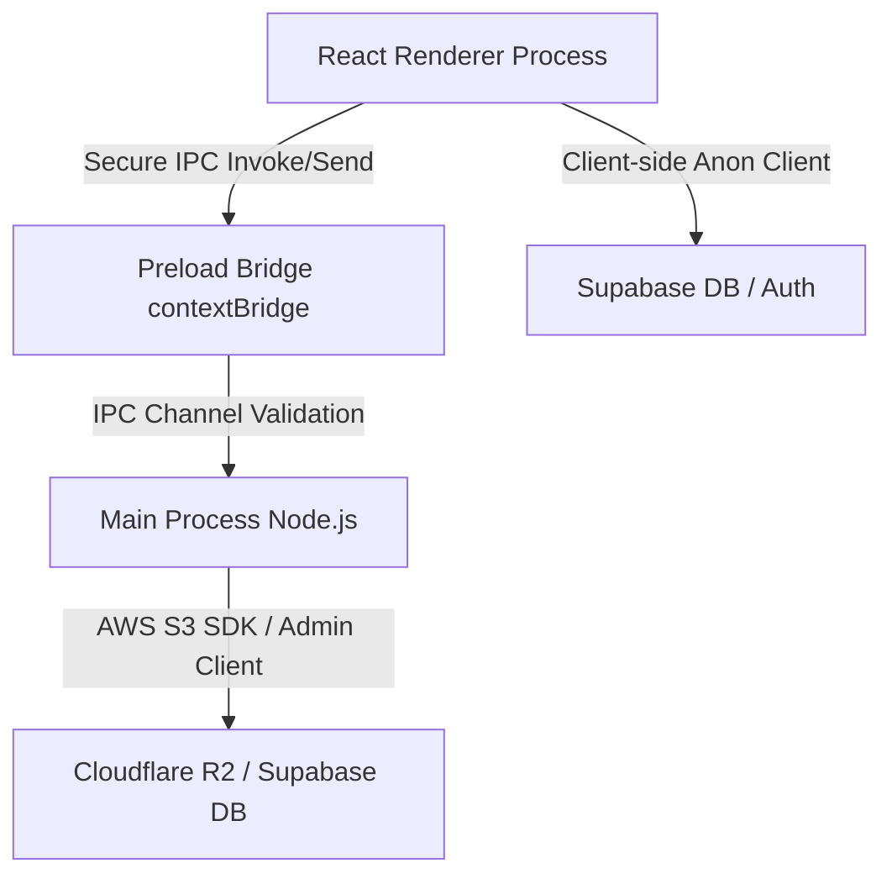

# Codebase Agent Instructions: Senior Electron, React & Supabase Architect

This document outlines the architectural standards, security rules, and implementation patterns for all AI agents and developers working on this desktop application. As a senior developer with extreme Supabase and Electron expertise, you must adhere strictly to these guidelines.

---

## 1. Process & Security Architecture

Electron separates execution into the **Main Process** (Node.js/Native APIs) and the **Renderer Process** (Chromium UI). Keeping these processes cleanly isolated and communicating securely is critical.

### IPC (Inter-Process Communication) and Sandbox Rules

- **Context Isolation & Sandboxing**: Keep context isolation enabled. Renderer scripts must never have direct access to Node.js built-ins or native modules.
- **The Preload Bridge**: Use `src/preload/index.ts` to expose narrow, explicit, and typed API functions to the renderer via `contextBridge.exposeInMainWorld()`.
- **No Raw IPC Exposure**: Never expose `ipcRenderer` or `ipcRenderer.send` directly to the window object. This is a severe security vulnerability.
- **Process Division of Labor**:
  - **Main Process**: File-system reads/writes, heavy calculations, native window operations, secure credentials management, and high-privilege external APIs (e.g., Cloudflare R2 uploads via `@aws-sdk/client-s3` or admin-level Supabase client operations).
  - **Renderer Process**: React component rendering, state management (Zustand/Context), and basic public database queries.



### IPC Data Flow Best Practices

- **Buffer Transmission**: When passing file data from the Renderer to the Main process for upload, transfer the file data as an `ArrayBuffer` in the IPC arguments. In the Main process, wrap it using `Buffer.from(fileBuffer)` to feed S3/R2 upload streams.
- **Error Boundaries**: Main-process IPC handlers (`ipcMain.handle`) must catch all internal errors and throw sanitized, user-friendly error messages. Unhandled errors inside Electron IPC handlers can cause silent crashes or expose internal stack traces.

---

## 2. React + TypeScript Development Standard

We build our UI using **React**, **TypeScript**, and **Vite** (via `electron-vite`).

### State & Performance Guidelines

- **Never Block the Main Thread**: Long-running synchronous loops must be avoided in both the renderer and main process. Use async/await and spawn child processes or worker threads for CPU-intensive work in the Main process if needed.
- **State Management**: Use React Context or lightweight state stores (like Zustand) to share settings and upload queues.
- **Component Modularity**: Divide the interface into pure presentational components and state-heavy containers. Maintain all styles under a cohesive design system.

### Strict TypeScript Formatting

- Always define explicit interfaces/types for IPC payloads.
- Extend the global `Window` interface to include the custom `api` object exposed by the preload script.
- Configure the compiler to enforce strict null checks (`"strict": true` in `tsconfig.json`).

---

## 3. Extreme Supabase & Database Mastery

Our application uses Supabase for authentication, real-time sync, and relational metadata. The schema includes `albums`, `photos`, and `featured_photos`.

### Schema and Row-Level Security (RLS)

- **RLS is Mandatory**: Every table in the `public` schema must enable Row-Level Security (`ALTER TABLE ... ENABLE ROW LEVEL SECURITY;`).
- **Policy Granularity**:
  - `authenticated` users (photographers/admins running the Desktop App) must have full CRUD privileges (`ALL`).
  - `public` users (end-users viewing albums on the web) must only have read privileges (`SELECT`).
- **Foreign Key Constraints**: Ensure cascade rules (`ON DELETE CASCADE`) are active for referencing tables (e.g., `photos` referencing `albums`) to avoid database state drift.

### The Dual-Client Strategy (Critically Important)

To guarantee data sync resilience and secure credential handling, we use a hybrid client model:

1.  **Renderer (Anon Client)**:
    - Initialized using `createClient(url, anonKey)` in `src/renderer/src/supabase.ts`.
    - Handles local database reads, standard authenticated operations, and realtime subscriptions.
    - Uses browser-standard token storage (e.g., `localStorage`) with configuration fallbacks.
2.  **Main Process (Admin Client / Service Role)**:
    - Initialized dynamically inside IPC handlers (e.g., `supabase-insert-photo`) using the service role key (`SUPABASE_SECRET_KEY`).
    - **Fallback Sync**: When a renderer-side insert fails (e.g., due to network drops, configuration mismatch, or RLS limitations), the app writes a local log and routes the operation to the Main process admin client as a fallback.
    - Never expose the admin client or the service role key to the preload bridge or renderer process.

```typescript
// Main Process Secure Insertion Fallback
ipcMain.handle('supabase-insert-photo', async (_event, photoPayload) => {
  const supabaseUrl = process.env.SUPABASE_URL
  const serviceRoleKey = process.env.SUPABASE_SECRET_KEY // Kept secure in Main env

  const { createClient } = await import('@supabase/supabase-js')
  const adminClient = createClient(supabaseUrl, serviceRoleKey, {
    auth: { persistSession: false, autoRefreshToken: false }
  })

  const { data, error } = await adminClient.from('photos').insert([photoPayload]).select().single()

  if (error) throw new Error(error.message)
  return data
})
```

### Desktop Auth & Token Handling

- **Disable URL Detection**: When initializing Supabase in Electron, always set `detectSessionInUrl: false` in the auth config to prevent Electron from attempting browser-style redirects within the renderer environment.
- **Encryption for Credentials**: If the user inputs custom Supabase credentials at runtime, do not store keys in plaintext `localStorage`. Use Electron's native `safeStorage` module in the Main process to encrypt and store sensitive environment overrides or session tokens, exposing them only via secure IPC getters.

---

## 4. Cloudflare R2 Media Pipeline

For large file uploads (such as high-res photos), we bypass Supabase Storage limits by uploading directly to a Cloudflare R2 bucket.

### R2 Integration Rules

- **Main Process Uploads Only**: R2 credentials (Access Keys, Secret Keys, Account IDs) must never be sent to the renderer. All S3 commands (`PutObjectCommand`, `DeleteObjectCommand`) are executed in the Main process using the `@aws-sdk/client-s3` library.
- **R2 Storage Usage Tracking**:
  - Use the Cloudflare REST API: `GET /accounts/{account_id}/r2/buckets/{bucket_name}/usage`.
  - Authenticate via a secure `CLOUDFLARE_API_TOKEN` bearer header.
  - Run this network request inside the Main process using Electron's native `net.fetch()` API (respects system proxies and avoids CORS issues). Return an unconfigured sentinel payload `{ payloadSize: 0, objectCount: 0, configured: false }` if environment variables are missing, instead of throwing IPC errors.

---

## 5. Offline Sync and Log Persistence

Desktop apps are subject to intermittent network connections. We must treat network failure as a standard application state.

- **Offline Buffering**: When uploads or database sync fail, append logs to a local file in the app's persistent user directory.
  - Log file path: `join(app.getPath('userData'), 'supabase_upload_errors.log')`
- **Queue Tracking**: Write the current state of pending uploads to a structured JSON file:
  - Status path: `join(app.getPath('userData'), 'pending_uploads_status.json')`
- **Automatic Retries**: Implement exponential backoff in the renderer/dbService for synchronizing pending queues once the window fires the `online` event.

---

## 6. Development, Packaging & Troubleshooting

### Environment Management

The main process dynamically loads variables at startup to support packaged configurations:

1.  Loads from `process.cwd()/.env` in development.
2.  Loads from `app.getAppPath()/.env` or `app.getPath('userData')/.env` in production packages.
3.  Vite compiles `VITE_` prefixed variables into the renderer bundle, but runtime environment changes must be retrieved dynamically from the Main process using `ipcRenderer.sendSync('get-env')`.

### Common Failure Points & Solutions

1.  **CORS Errors in Renderer**: Supabase queries or image loads hitting CORS limits.
    - _Solution_: Execute the API call in the Main process using Electron `net.fetch`, or verify that RLS / Bucket permissions in the Supabase control panel are set to public-read.
2.  **Missing DB Schema Relational Triggers**: Insertions failing due to missing parent album rows.
    - _Solution_: Ensure the parent album is validated and upserted in the database (via `supabase-insert-album` IPC handler) before inserting dependent photo metadata.
3.  **App Package Bundling Failures**: AWS SDK or Supabase JS client issues during `npm run build`.
    - _Solution_: Verify these libraries are imported using dynamic imports (`await import(...)`) inside IPC handlers or marked as external in the `electron.vite.config.ts` setup.
